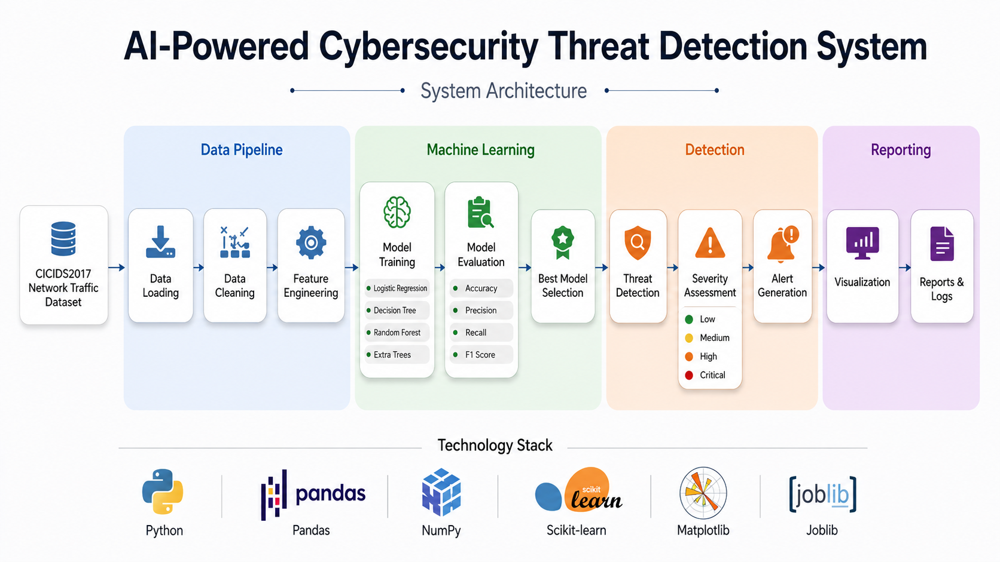
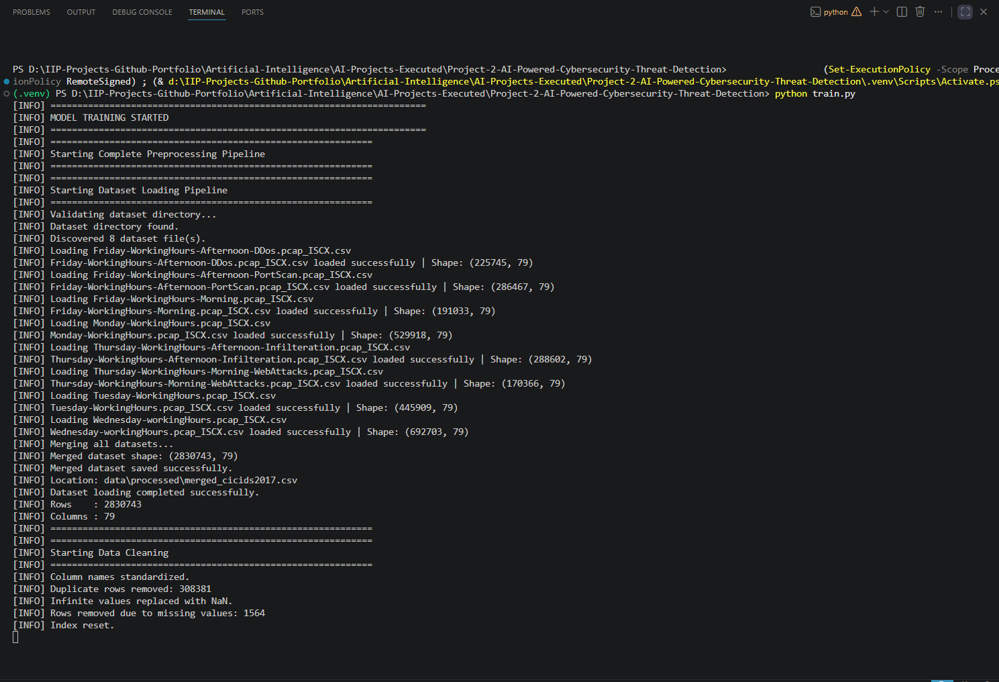
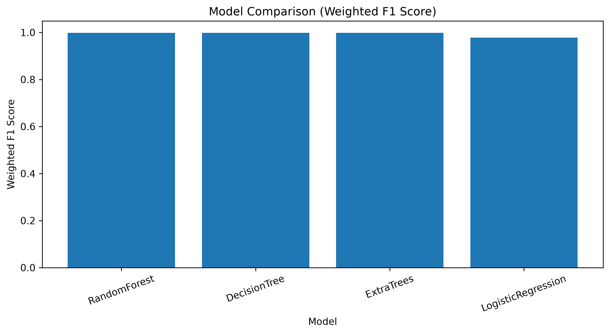
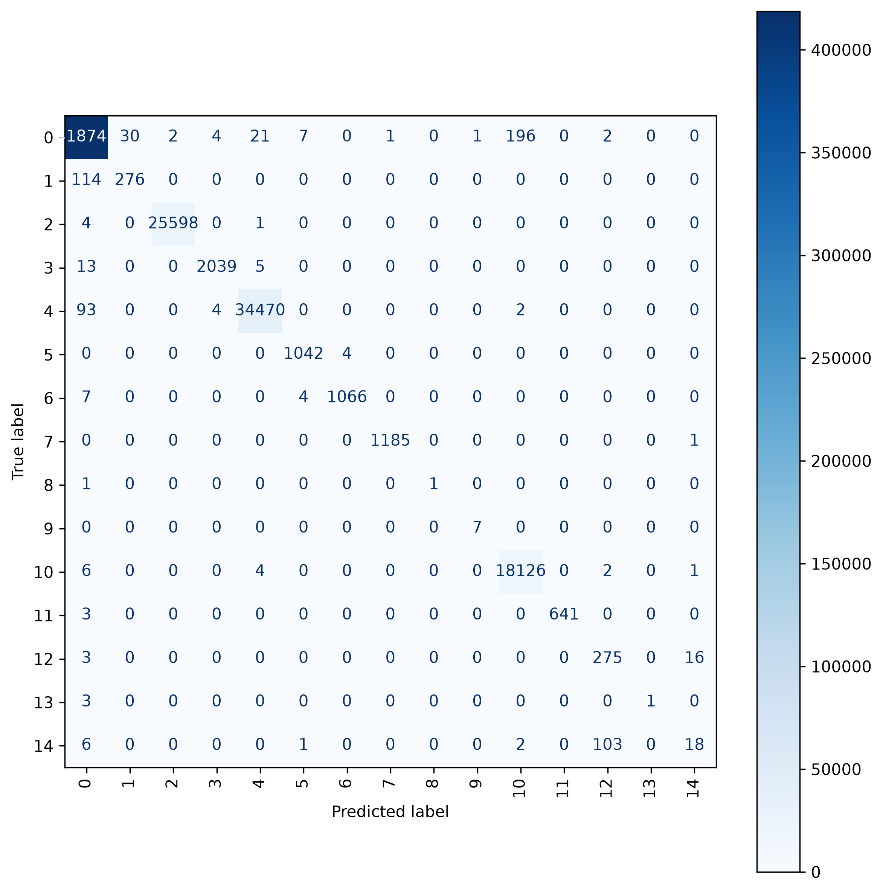
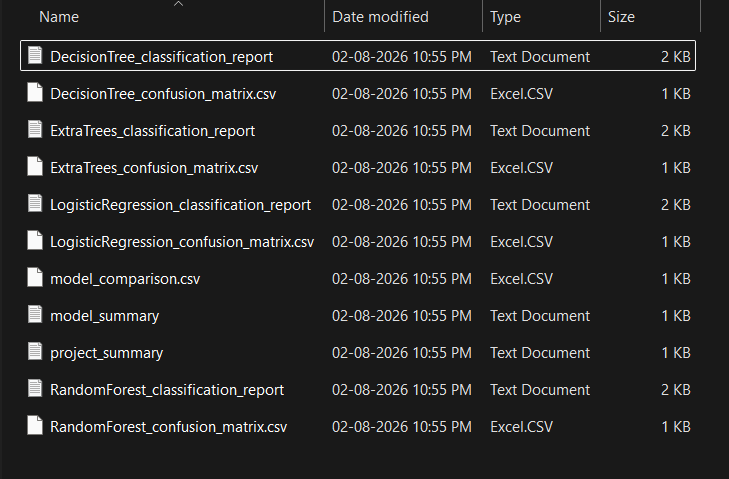
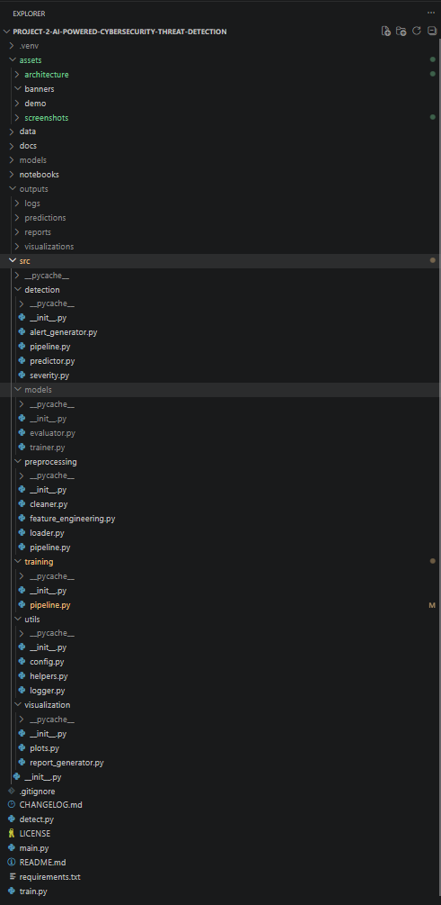

# AI-Powered Cybersecurity Threat Detection System

An end-to-end Machine Learning project for detecting and classifying network intrusions using the **CICIDS2017** dataset. The project implements a complete cybersecurity detection pipeline, including data preprocessing, feature engineering, model training, evaluation, threat prediction, severity assessment, automated reporting, and visualization.

Designed as a portfolio-quality project, it demonstrates the practical application of machine learning techniques for network security while following a modular and maintainable software architecture.

---

## Project Overview

Modern organizations generate massive volumes of network traffic every day, making manual threat analysis inefficient and error-prone. This project automates the detection of malicious network activities by training multiple machine learning models and selecting the best-performing classifier based on evaluation metrics.

The workflow covers the complete lifecycle of an ML-based cybersecurity solution:

- Data Loading
- Data Cleaning
- Feature Engineering
- Model Training
- Model Evaluation
- Best Model Selection
- Threat Detection
- Severity Assessment
- Alert Generation
- Visualization
- Report Generation

---

## Key Features

- End-to-end machine learning pipeline
- Network intrusion detection using the CICIDS2017 dataset
- Automated preprocessing and feature engineering
- Multiple machine learning algorithms for performance comparison
- Automatic best model selection using Weighted F1 Score
- Threat prediction on unseen network traffic
- Severity classification (Low, Medium, High, Critical)
- Risk score calculation for detected threats
- Automated report generation
- Visualization of model performance and detection results
- Modular and scalable project structure

---

## System Architecture

<p align="center">
  
</p>

The architecture is divided into four major stages:

### Data Pipeline
- Load CICIDS2017 dataset
- Clean missing values and duplicates
- Feature engineering and preprocessing

### Machine Learning
- Train multiple classification models
- Evaluate model performance
- Select the best-performing model

### Detection
- Predict network threats
- Assess severity level
- Generate alerts with risk scores

### Reporting
- Generate evaluation reports
- Produce visualizations
- Save prediction logs

---

## Project Workflow

```
CICIDS2017 Dataset
        │
        ▼
Data Loading
        │
        ▼
Data Cleaning
        │
        ▼
Feature Engineering
        │
        ▼
Train Multiple ML Models
        │
        ▼
Model Evaluation
        │
        ▼
Best Model Selection
        │
        ▼
Threat Detection
        │
        ▼
Severity Assessment
        │
        ▼
Alert Generation
        │
        ▼
Visualizations & Reports
```

---

## Project Structure

```text
AI-Powered-Cybersecurity-Threat-Detection/
│
├── assets/
│   ├── architecture/
│   └── screenshots/
│
├── data/
│   ├── external/
│   ├── processed/
│   └── raw/
│
├── models/
│
├── outputs/
│   ├── predictions/
│   ├── reports/
│   └── visualizations/
│
├── src/
│   ├── detection/
│   ├── models/
│   ├── preprocessing/
│   ├── training/
│   ├── utils/
│   └── visualization/
│
├── detect.py
├── train.py
├── main.py
├── requirements.txt
├── LICENSE
├── CHANGELOG.md
└── README.md
```

---

## Technology Stack

| Category | Technologies |
|----------|--------------|
| Programming Language | Python |
| Data Processing | Pandas, NumPy |
| Machine Learning | Scikit-learn |
| Visualization | Matplotlib |
| Model Serialization | Joblib |
| Dataset | CICIDS2017 |

---

## Installation

### 1. Clone the Repository

```bash
git clone https://github.com/<your-username>/AI-Powered-Cybersecurity-Threat-Detection.git

cd AI-Powered-Cybersecurity-Threat-Detection
```

---

### 2. Create a Virtual Environment

```bash
python -m venv .venv
```

Activate the virtual environment.

**Windows**

```bash
.venv\Scripts\activate
```

**Linux / macOS**

```bash
source .venv/bin/activate
```

---

### 3. Install Dependencies

```bash
pip install -r requirements.txt
```

---

## Dataset

This project uses the **CICIDS2017** network intrusion detection dataset.

Place the dataset inside the appropriate directory before training:

```text
data/
└── raw/
```

The preprocessing pipeline automatically performs:

- Missing value handling
- Duplicate removal
- Feature encoding
- Feature scaling
- Feature selection
- Dataset preparation for training

---

## Model Training

Train all machine learning models using:

```bash
python train.py
```

During execution, the pipeline:

- Loads and preprocesses the dataset
- Trains multiple machine learning models
- Evaluates each model
- Selects the best-performing model
- Saves trained models
- Generates evaluation reports
- Creates visualizations

The trained models are saved in:

```text
models/
```

---

## Threat Detection

Run threat detection using:

```bash
python detect.py
```

The detection pipeline:

- Loads the saved best model
- Predicts network traffic classes
- Calculates severity levels
- Computes risk scores
- Generates alert logs
- Saves prediction results

Prediction outputs are stored in:

```text
outputs/predictions/
```

---

## Generated Outputs

After training and detection, the project automatically generates the following outputs.

### Models

```text
models/
├── best_model.pkl
├── DecisionTree.pkl
├── ExtraTrees.pkl
├── LogisticRegression.pkl
├── RandomForest.pkl
├── scaler.pkl
└── label_encoder.pkl
```

---

### Reports

```text
outputs/reports/
```

Includes:

- Project Summary
- Model Summary
- Detection Summary
- Model Comparison
- Classification Reports
- Confusion Matrices

---

### Visualizations

```text
outputs/visualizations/
```

Generated visualizations include:

- Model Comparison
- Confusion Matrix
- Feature Importance (supported models)
- Threat Distribution
- Severity Distribution
- Risk Score Distribution
- Alert Timeline

---

## Project Screenshots

### System Architecture

<p align="center">
  
</p>

---

### Training Pipeline

<p align="center">

</p>

---

### Model Comparison

<p align="center">

</p>

---

### Confusion Matrix

<p align="center">

</p>

---

### Reports

<p align="center">

</p>

---

### Project Structure

<p align="center">

</p>

---

## Future Improvements

Possible future enhancements include:

- Deep Learning-based intrusion detection
- Real-time packet capture integration
- REST API deployment
- Docker containerization
- Streamlit web dashboard
- Cloud deployment
- Explainable AI (XAI) integration
- SIEM integration
- Automated model retraining
- CI/CD pipeline for continuous deployment

---

## License

This project is licensed under the **MIT License**.

See the **LICENSE** file for details.

---

## Author

**Pranav Raut**

Electrical Engineer | AI & Machine Learning Enthusiast

GitHub:  
https://github.com/pranavraut7-ai

LinkedIn:  
https://www.linkedin.com/in/pranavraut-ee/

---

If you found this project useful, consider giving it a ⭐ on GitHub.